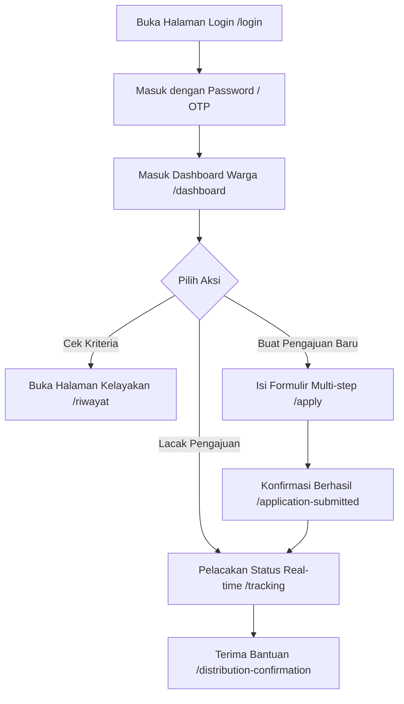
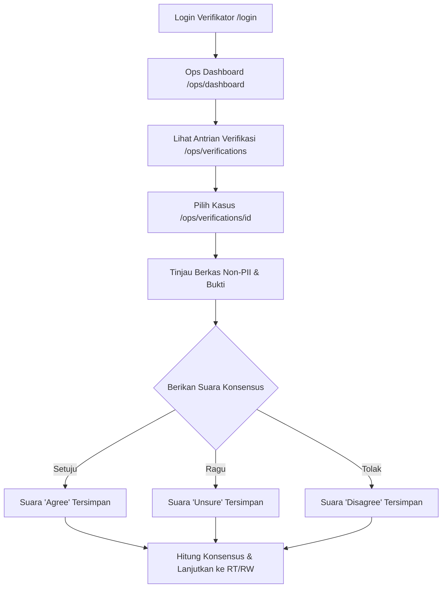
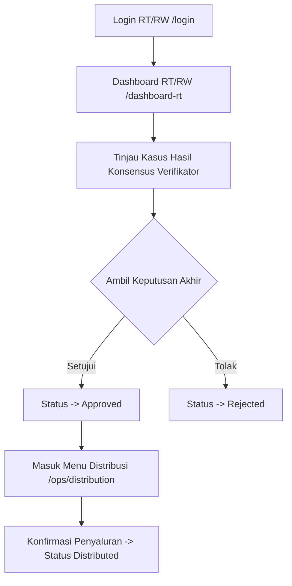
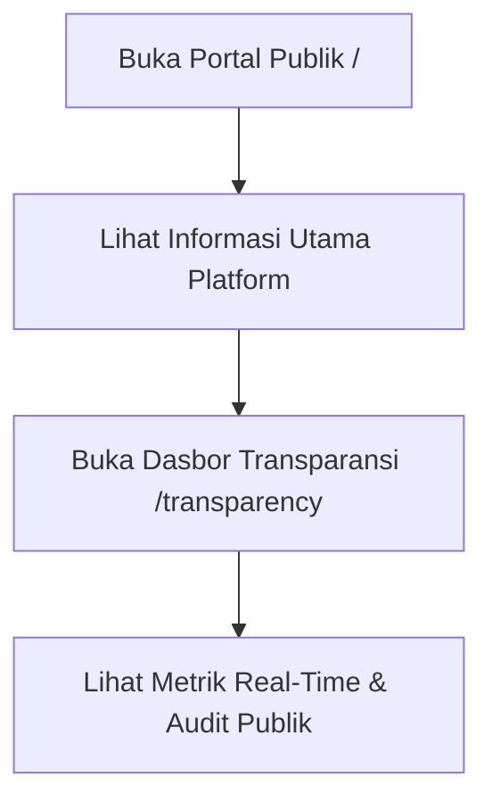

# Panduan Alur Penggunaan Platform BantuVerif

Dokumen ini menjelaskan alur penggunaan (*user flow*) platform **BantuVerif** untuk setiap peran pengguna (*role*). Platform ini dirancang menggunakan arsitektur **Konsensus Komunitas berbasis Multi-Peran** dan teknologi pelindungan data privasi (Non-PII).

---

## 👥 Ringkasan Peran Pengguna (*Roles*)

| Peran | Akses Route Utama | Deskripsi Tugas Utama |
|---|---|---|
| **Warga (Pemohon)** | `/dashboard`, `/apply`, `/tracking` | Mengajukan bantuan sosial, melacak status real-time, dan mengelola profil. |
| **Verifikator Komunitas** | `/ops/dashboard`, `/ops/verifications` | Meninjau berkas secara anonim (Non-PII) dan memberikan suara konsensus. |
| **Pengurus RT / RW** | `/dashboard-rt`, `/ops/distribution` | Memvalidasi hasil konsensus verifikator, menyetujui/menolak, dan menyalurkan bantuan. |
| **Publik / Auditor** | `/`, `/transparency` | Mengaudit statistik transparansi penyaluran bantuan secara real-time. |

---

## 1. 👤 Alur Pengguna: Warga (Pemohon Bantuan)

### Langkah-langkah Detail:

1. **Autentikasi (`/login`)**:
   - Warga masuk menggunakan email/nomor ponsel dengan Opsi OTP atau Kata Sandi.
   - Setelah masuk, sistem mengarahkan warga ke **Dashboard Warga** (`/dashboard`).

2. **Memeriksa Kriteria Kelayakan (`/riwayat`)**:
   - Warga dapat membaca syarat dan kriteria bantuan sosial sebelum mengisi formulir.

3. **Mengajukan Bantuan Sosial Baru (`/apply`)**:
   - Warga mengisi formulir multi-langkah:
     - **Langkah 1**: Data Diri & Identitas (Nama, NIK, No. KK).
     - **Langkah 2**: Alamat Domisili & Wilayah RT/RW.
     - **Langkah 3**: Unggah Berkas Pendukung (KTP, Surat Keterangan, Foto Rumah).
   - Setelah selesai, sistem menerbitkan **Kode Tracking Unik** (contoh: `BV-2026-883921`).

4. **Melacak Status Pengajuan (`/tracking` & `/tracking/[id]`)**:
   - Warga dapat memantau perjalanan pengajuan secara langsung melalui *timeline*:
     1. 🔵 **Pengajuan Diterima** (Tahap Awal)
     2. 🟣 **Verifikasi Komunitas** (Sedang Ditinjau Verifikator Lokal)
     3. 🟡 **Peninjauan RT / RW** (Menunggu Keputusan Pengurus)
     4. 🟢 **Penyaluran Bantuan** (Disetujui & Dalam Pengiriman)
     5. ✅ **Selesai** (Tersalurkan)

5. **Menerima Tanda Terima Penyaluran (`/distribution-confirmation`)**:
   - Ketika bantuan disalurkan, warga menerima bukti digital resmi pencairan dana/paket bantuan.

---

## 2. 🛡️ Alur Pengguna: Verifikator Komunitas

### Langkah-langkah Detail:

1. **Masuk ke Portal Operasional (`/ops/dashboard`)**:
   - Verifikator disambut dengan metrik utama:
     - Jumlah pengajuan tertunda yang membutuhkan suara.
     - Total kontribusi verifikasi pribadi.
     - Skor akurasi konsensus verifikasi.

2. **Daftar Antrian Verifikasi (`/ops/verifications`)**:
   - Verifikator melihat daftar pengajuan dalam wilayahnya secara **anonim** (nama & PII warga disamarkan untuk mencegah konflik kepentingan).
   - Menampilkan status suara saat ini (misal: `1/3 Suara Masuk`).

3. **Proses Verifikasi Kasus (`/ops/verifications/[id]`)**:
   - Verifikator memeriksa bukti dokumen (KTP tersamar, tagihan listrik, bukti lokasi).
   - Verifikator memilih **satu dari 3 pilihan suara**:
     - ✅ **Setuju**: Dokumen valid dan sesuai kriteria.
     - 🟡 **Ragu / Tidak Yakin**: Butuh klarifikasi berkas tambahan.
     - ❌ **Tolak**: Ditemukan ketidaksesuaian data / indikasi duplikasi.
   - Suara dimasukkan ke sistem database dan mempengaruhi **Skor Konsensus** secara otomatis.

---

## 3. 🏘️ Alur Pengguna: Pengurus RT / RW & Satgas

### Langkah-langkah Detail:

1. **Dashboard Khusus RT/RW (`/dashboard-rt`)**:
   - Menampilkan daftar pengajuan warga di wilayah RT/RW terkait yang sudah melewati tahap konsensus verifikator.
   - Menampilkan skor konsensus dari verifikator komunitas (contoh: *Skor Konsensus: 85%*).

2. **Pengambilan Keputusan Akhir**:
   - Pengurus RT/RW dapat meninjau detail dan mengklik **"Setujui"** atau **"Tolak"**.
   - Pengajuan yang disetujui akan berpindah ke status `approved` dan siap disalurkan.

3. **Manajemen Distribusi & Logistik (`/ops/distribution`)**:
   - Petugas RT/RW memantau daftar penerima bantuan yang telah disetujui.
   - Saat paket/dana diserahkan ke warga, petugas mengklik **"Konfirmasi Distribusi"**.
   - Sistem menerbitkan kode resi penyaluran (`receipt_code`) dan memperbarui status aplikasi menjadi `distributed`.

---

## 4. 🌐 Alur Pengguna: Publik & Transparansi

### Langkah-langkah Detail:

1. **Halaman Utama / Landing Page (`/`)**:
   - Memperkenalkan cara kerja konsensus sipil BantuVerif kepada masyarakat umum.

2. **Dasbor Transparansi Publik (`/transparency`)**:
   - Dapat diakses oleh siapapun tanpa perlu login.
   - Menampilkan statistik agregat non-PII secara langsung:
     - Total Pengajuan Terdaftar.
     - Jumlah Bantuan Disetujui & Tersalurkan.
     - Tingkat Persetujuan Konsensus.
     - Log Audit Publik (Buku besar event terverifikasi).

---

## 🔐 Ringkasan Keamanan & Hak Akses (RLS)

- **Warga**: Hanya bisa membaca & mengedit pengajuan milik diri sendiri (`user_id = auth.uid()`).
- **Verifikator**: Hanya bisa membaca data tampilan anonim (`verifier_application_summary`) dan hanya bisa mengisi suara verifikasi milik sendiri (`verifier_id = auth.uid()`).
- **RT/RW**: Hanya bisa membaca dan membuat keputusan untuk pengajuan yang sesuai dengan wilayah RT/RW yang terdaftar pada profilnya.
